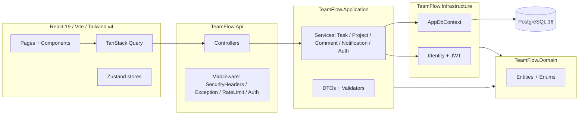

# TeamFlow

[](https://github.com/Mustazico/TeamFlow/actions/workflows/ci.yml)

A production-shaped team / project / task workspace. Kanban, comments with @mentions, in-app notifications, activity feed, dark mode, role-based project membership, JWT + refresh-token auth.

Built to demonstrate Clean Architecture in .NET 10 and a modern React 19 + Tailwind v4 client end-to-end.

**Live demo:** https://teamflow-web.onrender.com
_(Free tier — first request after 15 min idle may take ~30 s to wake.)_
**Browse read-only:** `guest@teamflow.local` / `Guest#12345` (or click **Continue as guest** on the login page)

---

## Screenshots

| Dashboard | Kanban board |
|---|---|
|  |  |

| Task detail + comments | Dark mode |
|---|---|
|  |  |

_Drop PNGs into [docs/screenshots/](docs/screenshots/) with the filenames above and they will render here._

---

## Highlights

- **Clean Architecture** — Domain / Application / Infrastructure / Api boundaries enforced via project references.
- **Authentication** — ASP.NET Core Identity + JWT access tokens + refresh-token rotation with revoke-on-use.
- **Authorization** — Per-project role model (Owner / Admin / Member / Viewer) checked in application services.
- **Notifications** — In-app fan-out for task assignment and @-mentions, dedupes self / non-members, 10 s polling bell with unread badge.
- **Activity feed** — Every write logs a structured `ActivityLog` row, exposed via the dashboard.
- **Production hygiene** — Rate limiting (global 100 req/min/IP + tighter 5 req/min on auth), security headers (CSP, X-Frame-Options, Referrer-Policy, Permissions-Policy, nosniff), `/health` endpoint with EF Core DB check, Serilog request logging, global exception middleware.
- **Tests** — xUnit + FluentAssertions + EF Core InMemory. Service-level unit tests for Task / Project / Comment / Notification flows.
- **CI** — GitHub Actions runs server build + tests, client lint + type-check + build, and both Docker images on every PR.
- **Dark mode** — Tailwind v4 with `@custom-variant dark`; persists per user.

---

## Architecture



---

## Stack

| Layer | Tech |
|---|---|
| Client | React 19, Vite, TypeScript, Tailwind v4, shadcn/ui patterns, TanStack Query, Zustand, React Router 7, React Hook Form + Zod, Recharts, dnd-kit, sonner |
| Server | .NET 10 ASP.NET Core, EF Core 10 + Npgsql, ASP.NET Core Identity, JWT bearer, FluentValidation, Serilog |
| DB | PostgreSQL 16 |
| Tests | xUnit, FluentAssertions, EF Core InMemory |
| Ops | Docker (multi-stage), GitHub Actions, Fly.io (target) |

---

## Repo layout

```
TeamFlow/
  client/                 React app + nginx Dockerfile
  server/                 .NET solution + API Dockerfile
    TeamFlow.Domain/      Entities + enums
    TeamFlow.Application/ Services + DTOs + interfaces
    TeamFlow.Infrastructure/ EF Core + Identity + JWT
    TeamFlow.Api/         Controllers + middleware + Program.cs
    TeamFlow.Tests/       xUnit service tests
  .github/workflows/      CI
  docker-compose.yml      Postgres + (optional) api + web profile
```

---

## Local development

### Option A — full stack in Docker

```powershell
docker compose --profile full up --build
```

- Web: <http://localhost:8080>
- API: <http://localhost:5080>
- Health: <http://localhost:5080/health>

Set `JWT_SIGNING_KEY` (≥ 32 chars) in the shell or a `.env` file before bringing the stack up, otherwise the API will refuse to start.

### Option B — local dev with hot reload

```powershell
# 1. Postgres only
docker compose up -d postgres

# 2. API
cd server
dotnet restore
dotnet ef database update --project TeamFlow.Infrastructure --startup-project TeamFlow.Api
dotnet run --project TeamFlow.Api      # http://localhost:5080  ·  Swagger at /swagger

# 3. Client
cd ../client
npm install
npm run dev                            # http://localhost:5173
```

### Default seeded admin

A local admin account is seeded on first migration in Development. See `server/TeamFlow.Api/Setup/DatabaseSeeder.cs` for the dev credentials, and override them via configuration / environment variables before deploying anywhere public.

### Required configuration

| Setting | Notes |
|---|---|
| `ConnectionStrings:Default` | Postgres connection string |
| `Jwt:SigningKey` | **Required**, must be ≥ 32 chars. Set via `Jwt__SigningKey` env var in prod. |
| `Jwt:Issuer` / `Jwt:Audience` | Default `TeamFlow` |

---

## Tests

```powershell
dotnet test server/TeamFlow.slnx
```

Service-level tests cover:
- Task assignment + reassignment notification fan-out, non-member rejection, overdue filter
- Project membership role enforcement (Add / Update / Remove / Delete)
- Comment mention fan-out (deduped, members-only, excludes self) + edit ownership
- Notification ownership checks (`MarkRead`, `MarkAllRead`, `UnreadCount`)

---

## Deploy (Fly.io)

The repo ships Dockerfiles for both apps. Suggested topology:

1. `flyctl launch --dockerfile server/Dockerfile` → `teamflow-api`
2. `flyctl launch --dockerfile client/Dockerfile` → `teamflow-web`
3. Managed Postgres (Neon recommended for durable free tier) — set `ConnectionStrings__Default`.
4. `flyctl secrets set -a teamflow-api Jwt__SigningKey=$(openssl rand -base64 48) ConnectionStrings__Default="..."`
5. Configure the web app to reach the API (either point nginx `/api/` at the API's internal `.flycast` address or split the API onto a public host).

A `deploy.yml` workflow with `workflow_dispatch` can be added once a `FLY_API_TOKEN` repo secret is set.

---

## Design decisions

- **Clean Architecture, no MediatR / CQRS** — services are explicit and trivially testable; MediatR adds ceremony without paying off at this scope.
- **Polling notifications, not SignalR** — 10 s poll with `refetchIntervalInBackground` is enough for the demo and avoids a stateful socket layer in v1. SignalR is a clean follow-up.
- **Tailwind v4 dark mode via `@custom-variant`** — global utility overrides in `index.css` give comprehensive dark support without touching every component.
- **Refresh-token rotation** — every refresh issues a new pair and revokes the previous; replay attempts revoke the entire family.
- **No Identity endpoints exposed** — `AuthController` wraps Identity behind a thin DTO surface validated with FluentValidation, and is rate-limited (5 req/min/IP).

---

## Known limitations / roadmap

- No realtime (planned: SignalR for notifications + board updates)
- No file attachments on tasks / comments
- No email delivery for notifications
- HTTP-level `WebApplicationFactory` integration tests scoped out for v1
- Client unit tests scoped out for v1 (build + lint enforced in CI)
